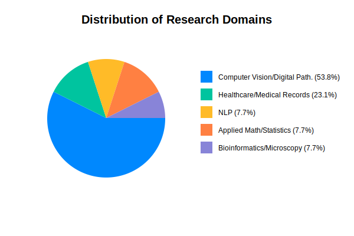
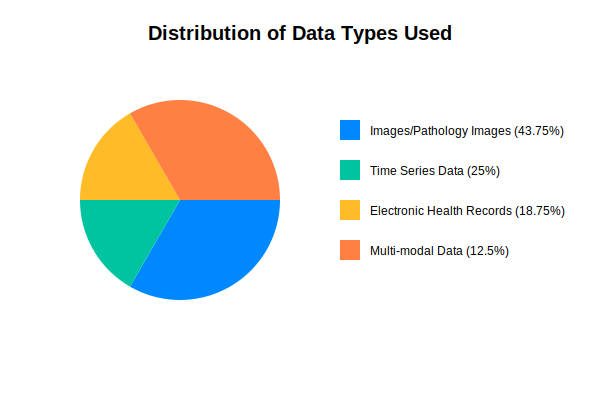
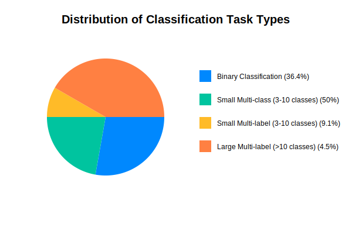

### XAI focus group results

## Research domains

The main research domains of the participants in the XAI focus groups were: 

1) Computer vision/Medical image computing (53.8%)

2) Healthcare/Medical records (23.1%)

3) Natural language processing (7.7%)

4) Applied mathematics/statistics (7.7%)

5) Bioinformatics/microscopy (7.7%)

## Data types

The different types of data used by the participants in their research were:

1) Images (43.75%)

2) Time-series data (25%)

3) Structured data (18.75%)

4) Multi-modal data (12.5%)

## Types of classification tasks

The types of classification tasks tackled by different participants in their research were grouped in five categories. These are described below along with a summary of participant responses.

1) Binary classification (36.4%)

2) Small multi-class (3 - 10 classes) classification (50%)

3) Large multi-class (>10 classes) classification (0%)

4) Small multi-label (3 - 10 classes) classification (9.1%)

5) Large multi-label (>10 classes) classification (4.5%)

Small multi-class classification is the most common type of classification problem encountered while no participants reported working on large multi-class classification tasks.

## How is XAI used throughout the model development lifecycle?

Apart from understanding the research domains, types of data and classification tasks and types of XAI approaches prevalent in literature and adopted by focus group participants, this survey is designed to evaluate the usage of XAI across four stages of the ML development lifecycle (for classification tasks):

1) Model Diagnosis - assessing how XAI is used to understand model behavior and error patterns

2) Model Improvement - evaluating how XAI insights are used to enhance model performance

3) Model Selection - understanding how XAI influences the choice of methods and visualization techniques and whether the rigour applied to selecting the best performing classifiers for a given task are extended to selection of XAI and visualisation approaches

4) Stakeholder Communication - examining how XAI is used to explain models and decisions to various stakeholders

Analysis of the focus group responses reveals distinct patterns in how XAI methods are currently employed within the machine learning development lifecycle. The predominant application centers on model diagnosis, with a particular emphasis on feature importance interpretation and sanity checking procedures. Notably, 10 out of 13 participants reported using XAI for these fundamental diagnostic purposes, indicating a strong consensus around its utility in understanding model behavior at a basic level.

The visualization approaches employed by practitioners demonstrate a reliance on conventional performance metrics, with ROC curves and confusion matrices being ubiquitously cited. While some participants reported using more sophisticated techniques such as occlusion maps and latent space visualization, there appears to be a significant gap between the theoretical potential of XAI visualization methods discussed in current literature and their practical implementation. This disparity is particularly evident in the limited adoption of interactive and dynamic visualization techniques that could enhance stakeholder engagement and understanding.

When examining model improvement applications, the responses indicate less consistent utilization of XAI methods compared to diagnostic purposes. While practitioners acknowledge the potential for XAI to inform feature selection and evaluate model robustness, there appears to be limited systematic integration of XAI insights into the iterative improvement process. This contrasts markedly with current literature, which emphasizes the potential for XAI to drive targeted model refinements and architectural decisions throughout the development cycle.

Stakeholder communication emerged as a particularly challenging aspect of XAI implementation. Several participants noted the difficulty in conveying complex explanations to diverse audiences, with one participant specifically highlighting the varying receptiveness of medical professionals to different visualization approaches. This finding aligns with current literature emphasizing the need for audience-specific explanation strategies, but suggests that practical implementation of such targeted approaches remains challenging.

Current literature in XAI emphasizes the importance of systematic evaluation frameworks and quantitative metrics for assessing explanation quality. However, the focus group responses indicate limited adoption of such formal evaluation approaches, with practitioners instead relying primarily on qualitative assessment and stakeholder feedback. This represents a significant opportunity for improvement in XAI implementation practices.

To address these gaps, several evidence-based recommendations emerge from current literature. First, organizations should consider implementing structured protocols for XAI method selection and evaluation, incorporating quantitative metrics such as faithfulness measures and stability assessments. Second, the development of stakeholder-specific visualization strategies should be prioritized, with particular attention to the varying technical literacy levels of different audiences. Third, practitioners should expand their use of XAI beyond post-hoc explanation to include early-stage model development decisions and ongoing monitoring of model behavior.

The integration of automated XAI pipelines represents a promising direction for improving current practices. Such pipelines could standardize the evaluation of explanation quality and facilitate continuous monitoring of model behavior, addressing the current ad hoc approach evident in practitioner responses. Furthermore, the development of interactive explanation interfaces could bridge the gap between technical capability and stakeholder comprehension, addressing the communication challenges highlighted by multiple participants.

These findings suggest that while XAI has achieved significant adoption for basic model diagnosis, substantial opportunities exist for more comprehensive integration throughout the model development lifecycle. By adopting more systematic approaches to XAI implementation and evaluation, organizations can better realize the full potential of these methods for both technical optimization and stakeholder engagement. Future research should focus on developing practical frameworks for implementing these recommendations while accounting for the resource and expertise constraints faced by practitioners.
